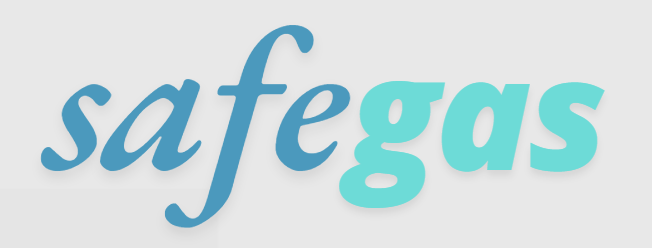

<p align="center">
  
</p>
O SafeGas é um projeto de sistemas embarcados desenvolvido durante a disciplina PMR0120 para aumentar a segurança doméstica contra vazamentos de gás de cozinha. O dispositivo identifica a presença de gás no ambiente, envia notificações ao usuário e aciona automaticamente o fechamento do sistema de gás, prevenindo acidentes e garantindo maior tranquilidade.

## 🚀 Como funciona

* O **ESP32** é o microcontrolador central, responsável por processar os dados dos sensores e gerenciar as ações do sistema.
* Um sensor de gás detecta concentrações anormais no ambiente.
* Caso seja identificado um vazamento, o dispositivo:

  1. **Notifica o usuário** via aviso sonoro
  2. **Ativa o fechamento automático** da válvula de gás.

## 🔧 Tecnologias utilizadas

* **ESP32**: microcontrolador principal com suporte a Wi-Fi e Bluetooth.
* **Sensor de gás (MQ-2)**: responsável pela detecção do vazamento.
* **Atuador/válvula solenoide**: controla o fechamento do fornecimento de gás.
  
<p align="left">  </p>
---

## 🎯 Objetivo

O objetivo do projeto é **prevenir acidentes domésticos** relacionados ao uso de gás de cozinha, oferecendo uma solução acessível, inteligente e integrada ao dia a dia das pessoas.

## 📌 Futuras melhorias

* Integração com assistentes virtuais (Google Home, Alexa).
* Painel de monitoramento em tempo real via dashboard web.
* Alimentação de emergência com bateria para funcionamento em quedas de energia.
* Integração com apps.

---


## 📂 Estrutura do Repositório  

```bash
├── docs/              # Documentação do projeto
├── src/               # Código-fonte principal
├── tests/             # Testes automatizados
├── assets/            # Imagens, ícones e mídias
└── README.md          # Documentação principal


